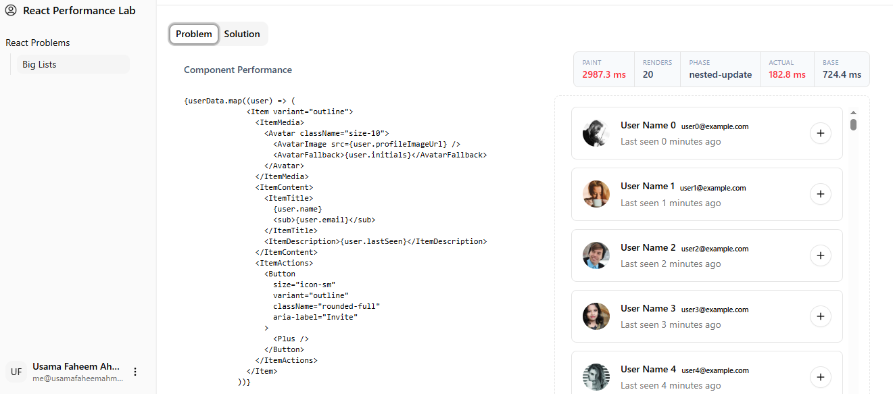
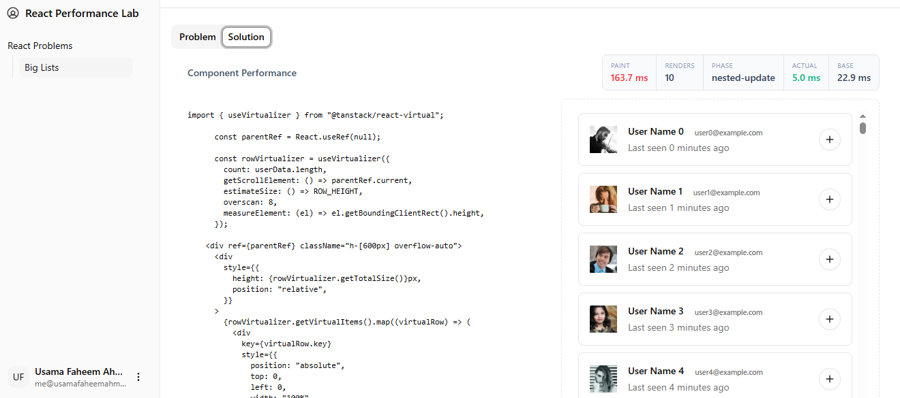

# Big List Rendering Performance Lab

This performance lab demonstrates how rendering large lists without optimization
can severely impact UI responsiveness, and how list virtualization using
TanStack Virtual dramatically improves performance.

🔗 **Live Demo:**  
https://usamafaheemahmed.github.io/react-performance-lab/#/big-lists

---

## Problem Overview

A list containing thousands of rows was rendered directly in the DOM.
Each state update (such as filtering or searching) triggered full re-renders,
causing noticeable input lag and slow paint times.

---

## Solution Summary

To optimize rendering performance:

- Implemented **list virtualization** using **TanStack Virtual**
- Reduced the number of mounted DOM nodes
- Ensured only visible rows were rendered at any given time

---

## Results

| Metric        | Before Optimization | After Optimization |
|--------------|--------------------|-------------------|
| Paint Time   | ~8694 ms           | ~265 ms           |
| Actual Time  | ~768 ms            | ~5.7 ms           |
| Base Time    | ~2189 ms           | ~26.5 ms          |
| Renders      | 14                 | 10                |

✔ Over **95% reduction** in render cost  
✔ Eliminated input lag  
✔ Smooth scrolling and interaction

---

## Performance Comparison

**Before Optimization:**

**After Optimization:**

## Tools Used

- React
- React DevTools Profiler
- **TanStack Virtual**
